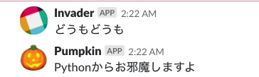

SlackPostman
===

Slackに投稿するよ!



## Webhook URL

ここから登録。

[https://slack.com/apps/A0F7XDUAZ--web-](https://slack.com/apps/A0F7XDUAZ--web-)

## Usage

Python のほう。

```python
postman = SlackPostman(
    webhook_url,
    sender = 'Invader',
    sender_emoji = ':trollface:'
)
postman.post('どうもどうも')
```

PHP のほう。

```php
$postlady = new SlackPostlady(
    $webhookUrl,
    'Invader',
    ':trollface:'
);
print($postlady->post('test'));
```
